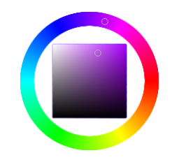

# 这是一个使用canvas制作的，颜色选择器，支持PC和移动端。

这是[demo](http://www.rni-l.com/project/canvas-colorPicker/)链接，支持PC和移动端。

这里全采用canvas制作，没有使用到图片。

## 如何使用

commonjs:
```
import ColorPicker from '../colorPicker.js'

new ColorPicker({
  dom: '.wrap',
  width: 200,//画布宽高
  height: 200,
  outsideWidh: 30,
  callback(color) {
    // color
  }
}).init()
```

通过 script 标签引入
```
<script src='colorPicker.js'></script>
window.ColorPicker({ ... })
```

不需要写 html 和 css

## 兼容性

可以兼容到ie9。

## 制作外环颜色

首先把外环的颜色制作出来，这里使用了hsl来处理。


使用moveTo和lineTo，一条条线的绘制出来。起始位置是内圆坐标，终点位置外圆坐标，这样就可以制作出圆环了，而且中心是透明无色的。

```
const ctx = this.ctx
for (let i = 0; i < 360; i += 0.1) {
  // 获取度数
  const rad = i * (2 * Math.PI) / 360,
    c_x = Math.cos(rad),
    c_y = Math.sin(rad),
    lineW = this.lineW
  ctx.strokeStyle = "hsl(" + i + ", 100%, 50%)"
  ctx.beginPath()
  ctx.moveTo(x + (x - lineW) * c_x, y + (y - lineW) * c_y)
  // 求出另外两点坐标
  ctx.lineTo(x + x * c_x, y + y * c_y)
  ctx.stroke()
  ctx.closePath()
}
```

## 绘制正方形的颜色。

这里是用从外环获取的颜色，加上白色从左到右的渐变，加上黑色从下到上的渐变，制造出来的。外环每次改变颜色后，正方形的颜色都要改变。

```
reateInsideColor(color) {
  // 生成内颜色
  const ctx = this.ctx,
    rectW = this.rectW,
    rectX = this.rectX // 起点坐标
  // 清除指定区域
  ctx.clearRect(rectX, rectX, rectW, rectW)
  ctx.fillStyle = color
  ctx.fillRect(rectX, rectX, rectW, rectW)
  // 白色
  let g = ctx.createLinearGradient(rectX, (rectX + rectW) / 2, rectX + rectW, (rectX + rectW) / 2)
  g.addColorStop(0, "#FFFFFF")
  g.addColorStop(1, "rgba(255,255,255,0)")
  ctx.fillStyle = g
  ctx.fillRect(rectX, rectX, rectW, rectW)

  // 黑色
  g = ctx.createLinearGradient(rectX, rectX + rectW, rectX, rectX)
  g.addColorStop(0, "#000000")
  g.addColorStop(1, "rgba(0,0,0,0)")
  ctx.fillStyle = g
  ctx.fillRect(rectX, rectX, rectW, rectW)
}
```


## 获取颜色

获取颜色就是用到了canvas的getImageData，获取到x,y坐标后，`ctx.getImageData(x,y,1,1)`得到颜色的数据，最后组装下就获取到rgb了。

## 如何判断坐标是在圆环内？

这里先求出移动的点到圆心点的距离，再判断这段距离是否大于内圆的半径且小于外圆的半径，这样就可以了。


如果哪里有问题希望可以提出来，我再改进下，谢谢~~    :)
